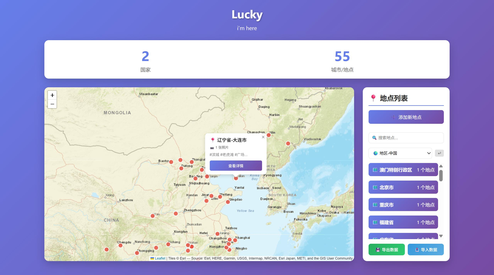
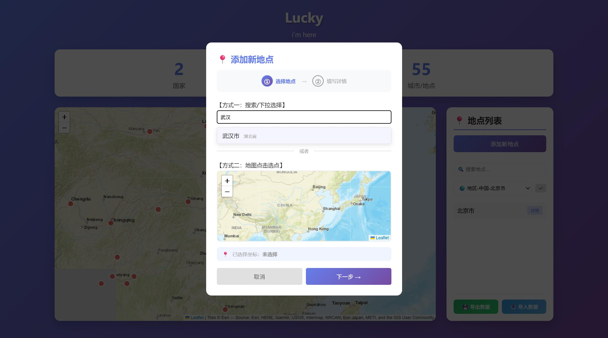
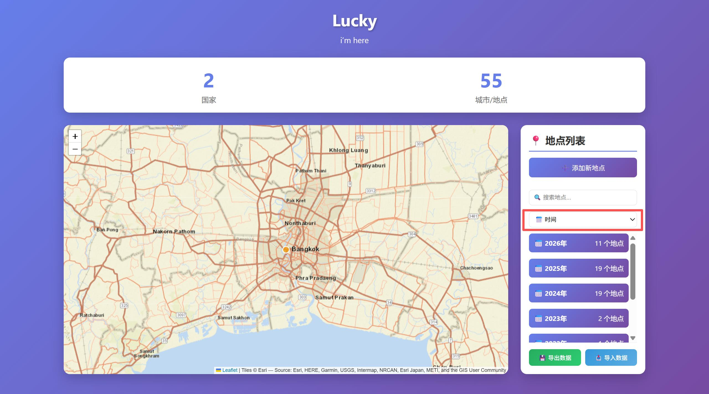
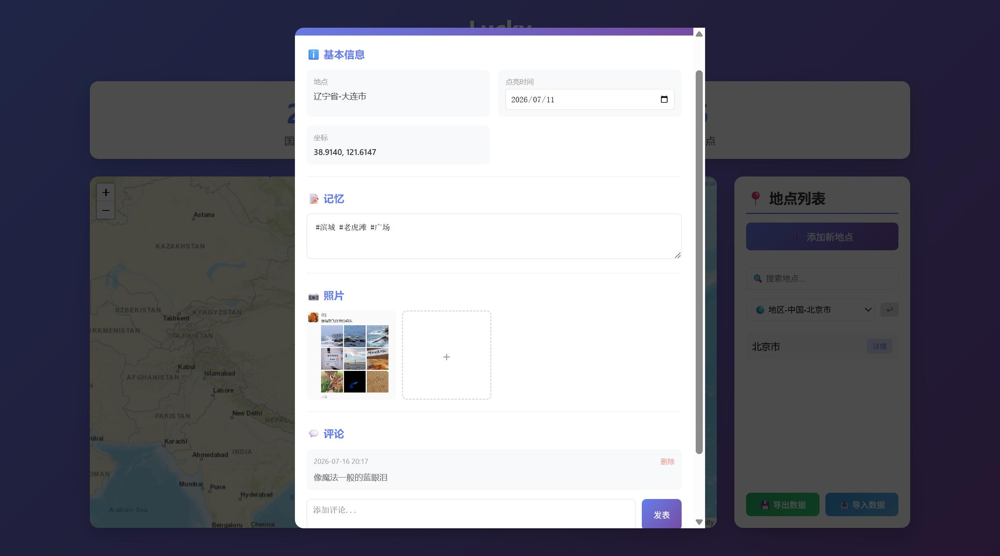
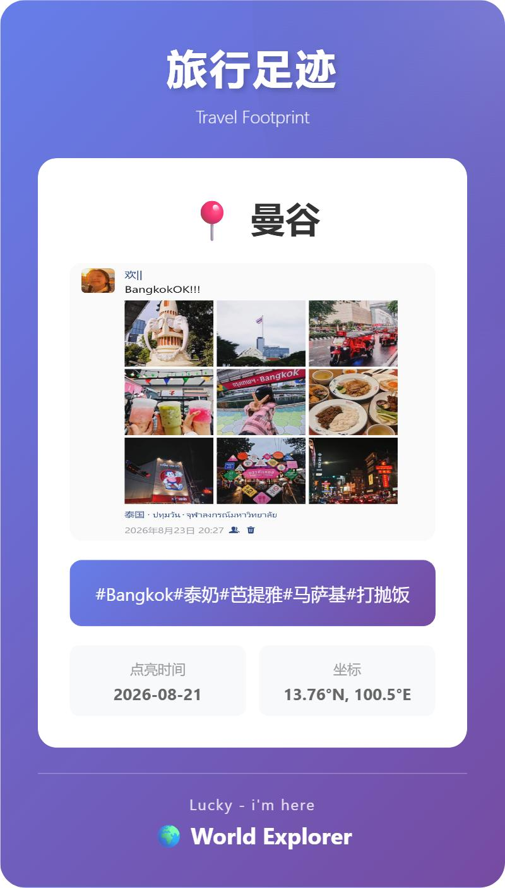
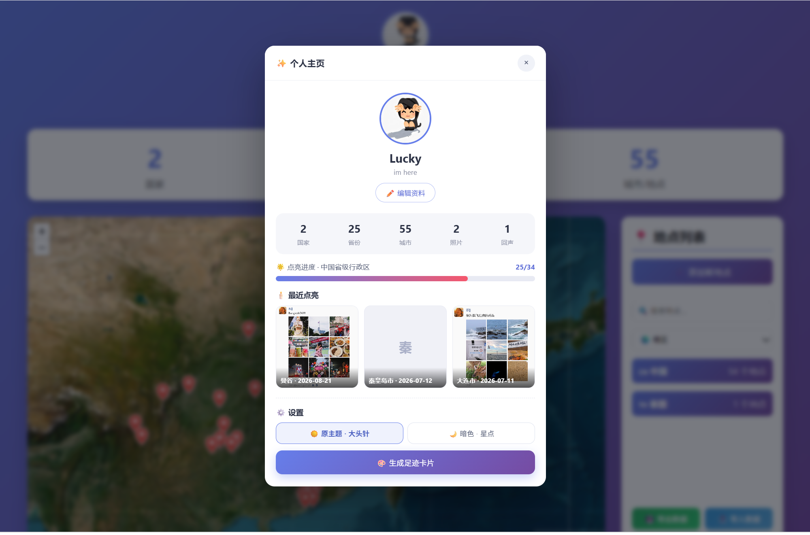

# Stary World ✨

> **Light up the world, keep every story. 点亮世界，收藏故事。**

Stary World 是一个**纯前端、零后端、打开即用**的个人旅行足迹地图：把去过的每一座城市在地图上点亮成一颗星，顺手存下照片、日期和当时的心情，还能一键生成精美的回忆卡片分享给朋友。

名字 **Stary = Star（点亮如星）+ Story（旅行故事）**。

🔗 **在线体验**：[https://happyhappylan.github.io/stary-world/](https://happyhappylan.github.io/stary-world/)

---

## 📸 产品预览

### 主界面：世界地图 + 足迹点亮


### 添加新地点：省-市-区三级联动


### 侧边栏搜索：按城市或省份快速查找


### 地点详情：照片墙 + 记忆 + 点亮时间


### 一键生成回忆卡片


### 个人主页


---

## 🚀 核心功能

| 功能 | 说明 |
|------|------|
| 🗺️ 世界地图点亮 | 基于 Leaflet，到访地点以彩色标记在地图上点亮 |
| 📍 两种选点方式 | 国内**省-市-区三级联动**精确选点；海外**经纬度自动识别国家** |
| 📷 多照片记录 | 批量上传照片，网格预览，可单张删除 |
| 📅 点亮时间 | 记录并可编辑旅行日期（年-月-日） |
| ✍️ 记忆文字 | 为每个地点留下当时的心情与标签 |
| 🃏 回忆卡片 | 一键生成渐变背景 PNG 卡片（含照片、坐标、签名），自动下载分享 |
| 🔎 智能搜索 | 按城市名或省份名实时过滤 |
| 💾 数据持久化 | localStorage 自动保存 + 导入 / 导出 data.js 永久备份 |

---

## 🛠️ 技术栈

- **Leaflet.js** — 轻量交互式地图
- **html2canvas** — 回忆卡片截图生成
- **Esri World Street Map** — 地图底图（稳定、全球覆盖）
- **原生 HTML / CSS / JavaScript** — 无框架、无构建工具
- **HTML5 File API / FileReader** — 多图上传与 Base64 预览
- **localStorage** — 浏览器本地数据持久化

---

## 📁 项目结构

```
stary-world/
├── index.html          # 主应用（全部 UI 与交互逻辑）
├── data.js             # 旅行数据（国家→城市，照片以 Base64 内嵌）
├── china-cities.js     # 中国省市坐标库（省→市→经纬度，供三级联动）
├── Bangkok.png         # 示例回忆卡片
├── 武汉大学.jpg         # 示例照片
├── screenshots/        # 产品效果截图
└── LICENSE             # MIT License
```

---

## 📊 数据结构

```javascript
const travelData = {
  name: "Lucky",
  slogan: "im here",
  countries: [
    {
      name: "中国",
      flag: "🇨🇳",
      color: "#e74c3c",
      cities: [
        {
          name: "秦皇岛市",
          province: "河北省",
          lat: 39.9365,
          lng: 119.5982,
          description: "#北戴河",
          visitDate: "2026-07-12",
          photos: [],
          comments: []
        }
      ]
    }
  ]
};
```

---

## ▶️ 本地运行

无需安装任何依赖，**直接双击 `index.html` 即可在浏览器中打开**。

推荐使用 Chrome / Edge / Firefox / Safari，不支持 IE。

---

## 💾 数据保存说明

- **临时保存**：添加或修改地点后自动写入浏览器 `localStorage`，刷新页面可选择恢复。
- **永久保存**：点击「导出数据」下载 `data.js`，替换项目目录中的同名文件，即可永久保留。

---

## 🧭 下一步计划

- 接入云端同步与账号体系
- 手机端 PWA 适配
- 足迹长图导出与好友打卡对比
- 从个人足迹本升级为可社交的旅行记录社区

---

## 📄 License

本项目基于 [MIT License](LICENSE) 开源。

Copyright © 2026 Lan Huanhuan
